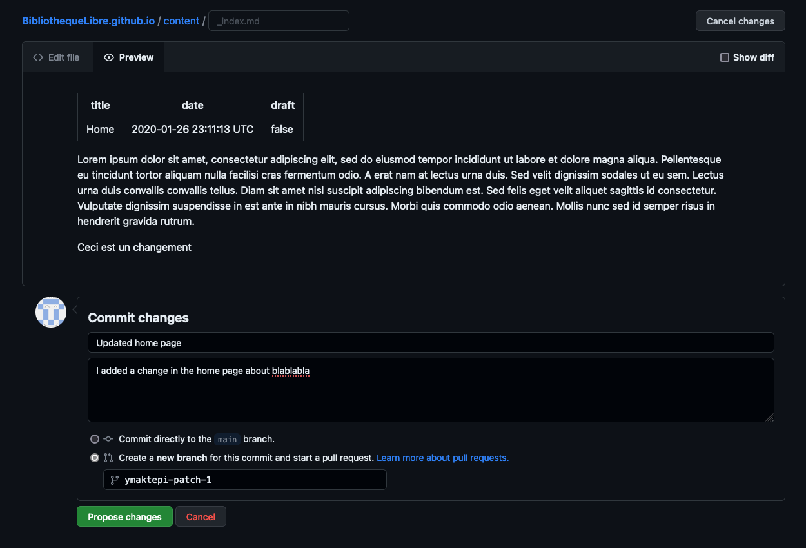
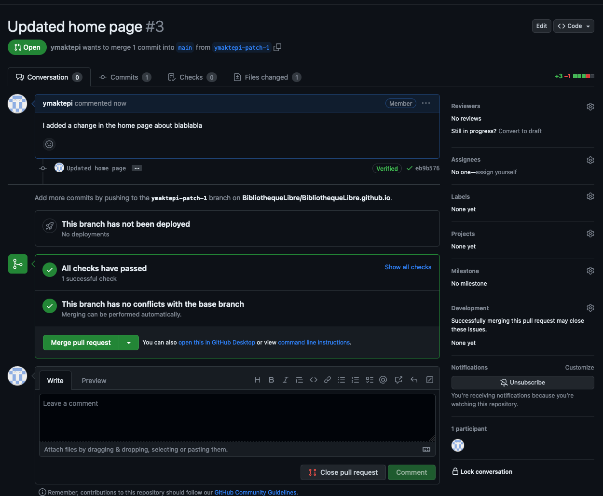

# README

## Content Management

### Github Organisation

You must be added as a contributor in the BibliothequeLibre organisation on Github in order to edit the website.
> TODO: process to add contributors

### Editing text content

To edit text content, go to the [`content`](content) folder. There are currently 3 files in there:

- [`_index.md`](content/_index.md):
    - The "Home" page
- [`agenda.md`](content/agenda.md):
    - The "Agenda" page
- [`livres.md`](content/livres.md):
    - The "Livres" page. You can freely edit the content of this file but keep in mind that the list of books is
      automatically added at the bottom.

All of those files are in Markdown format. You can have a look at the [Dillinger](https://dillinger.io/) website to
understand how the formatting works.

To edit the text, go to the file in question, hit "edit" (the pen icon) and edit your file. You can use the "Preview"
tab to show the changes in a prettier way. Then, select "Create a new branch for this commit and start a pull request".
You should add a Commit message and some details if necessary:


You can then hit "Create pull request". Wait for a bit until you get a greenlight from the automated checks:
.

You can then hit "Merge pull request".

On paper, you could also ask for reviews from other team members before merging the pull request so that multiple people
confirm they are OK with your changes.

> TODO: process to add images :)
> broadly: add image into `static/images/` folder, add `` where you want your
> image
> to pop and that's it

## Dev stuff

### Hugo

Version: 0.111.3 - To be changed in the workflow tasks eventually. Install Hugo and then run `hugo server` for local
development.

In order to inject some logic only on the `/livres` page, `type: livres` is set in the front matter of the `livres.md`
file and a new `layouts/livres/single.html` file was created.

### Favicons

On [favicon.io](https://favicon.io/favicon-generator):

- Generate from Text
    - Text: BL
    - Background: Rounded
    - Font Family: Roboto
    - Font Variant: Black 900 Normal
    - Font Size: 73
- Follow install steps on website

### Google Sheets Proxy

With the help
of [this post](https://stackoverflow.com/questions/62732791/get-data-from-google-sheets-without-sheets-api),
create a new [Google App Script](https://script.new), deploy it as a Web Application, make it accessible to the public
and act in your name.

Use the following code to map it to your Google Sheet:

```js
function doGet(e) {
    const id = "1GBq2jBEA_wXXTyTdGDSARicH0yT_xDbwlH1RgdnzLfM";
    const sheetName = "Sheet1";
    const sheet = SpreadsheetApp.openById(id).getSheetByName(sheetName);
    const values = sheet.getDataRange().getValues();
    return ContentService.createTextOutput(JSON.stringify({values: values})).setMimeType(ContentService.MimeType.JSON);
}
```

Then paste the URL of your WebApp to [`config.ts`](assets/ts/app/config.ts).
> Note: the structure of the google sheet should match the processing logic inside `config.ts`